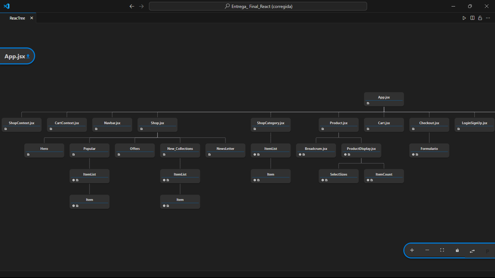
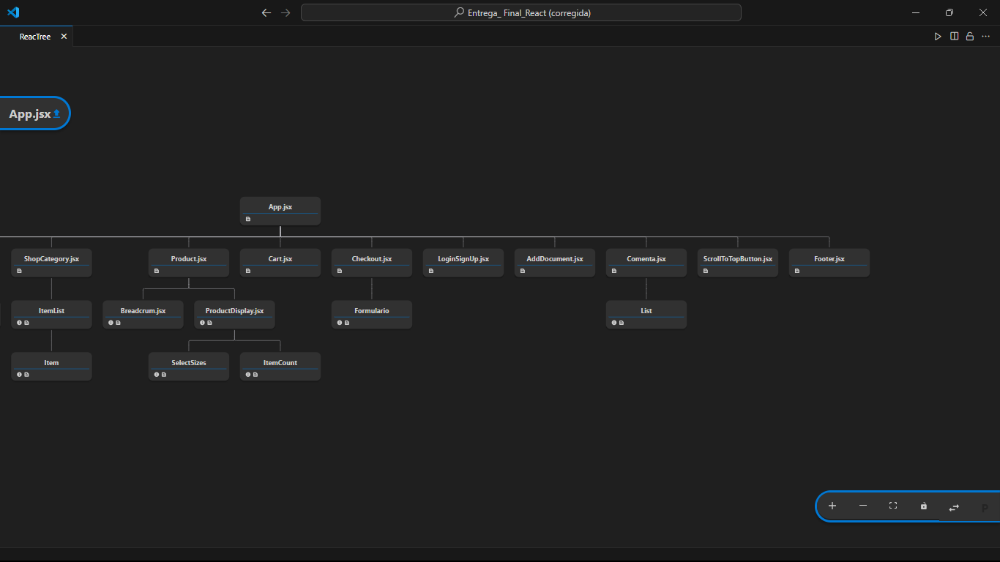

# E-commmerce React - entrega final (corrección)

#### Dev - Harold Díaz

##### Imagen de la estructura de la entrega final

## Anotaciones:

# Proyecto `entrega_final_react` - Ecommerce con React JS

Este es un proyecto de ecommerce de ropa con tres categorías principales: hombres, mujeres y niños. El proyecto comenzó en un módulo anterior y se ha ido mejorando con nuevas funcionalidades aprendidas en clases y correcciones post-entrega.

## Funcionalidades

1. Gestión de Base de Datos con Firebase
Se implementaron las operaciones CRUD (Crear, Leer, Actualizar y Eliminar) en una base de datos no relacional utilizando Firebase y MongoDB. Al principio fue un reto, ya que estaba más familiarizado con MongoDB. PEro finalmente, logré renderizar, modificar y crear productos desde una colección en Firebase, aunque aún queda pendiente mejorar el manejo de sub-colecciones para obtener toda la información correctamente. Este componente interactúa con Firebase para escribir y leer comentarios. Además, para proteger información sensible, como la conexión a la base de datos, utilicé variables de entorno para enmascarar las credenciales.

2. Simulación de Registro de Usuarios
Simulé un registro de usuarios con un botón llamado "Ingresa" y un formulario básico. El plan era almacenar los datos en localStorage, aunque esta funcionalidad no se completó debido a limitaciones de tiempo.

3. Carrito de Compras
El componente Cart incluye una lógica que muestra un GIF cuando no hay productos en el carrito y, si hay productos, muestra la cantidad de ítems. A pesar de intentarlo varias veces, no logré renderizar todos los parámetros de los productos en el carrito.

4. Uso de Variables de Entorno
Para mayor seguridad, utilicé variables de entorno para enmascarar información sensible, como las credenciales de acceso a la base de datos y las configuraciones de MongoDB.

5. Manejo de Stock 
Checkout Component
El componente Checkout gestiona el proceso de compra en una aplicación de ecommerce. A continuación se presenta un resumen de su funcionalidad y estructura:

### Funcionalidad

Estado del Formulario:

Utiliza el estado local (datosForm) para almacenar la información ingresada por el usuario en el formulario de checkout, incluyendo nombre, dirección, teléfono y email.

### Manejo de Inputs:

La función handleChangeInput actualiza el estado del formulario a medida que el usuario ingresa datos.
Generación de Orden:

La función generateOrder guarda la orden en la colección "orders" de Firebase Firestore.
Muestra una alerta de éxito con el ID de la orden y luego redirige al usuario a la página principal.
Después de guardar la orden, actualiza el stock y limpia el carrito de compras.
Actualización del Stock:

La función updateStock recorre los elementos del carrito y actualiza el stock de cada producto en Firestore restando la cantidad comprada.
Muestra una alerta de éxito si el stock se actualiza correctamente o una alerta de error si ocurre un problema.
Validación del Formulario:

La función handleSubmitForm previene el comportamiento por defecto del formulario, valida los datos ingresados y, si la validación es exitosa, genera la orden.
Usa la función validateForm para validar los datos del formulario.

### Renderizado:

Muestra un mensaje de bienvenida, un GIF de carga y el formulario de checkout (Formulario).

Relación con el Stock
El componente Checkout actualiza el stock de los productos después de que se completa una orden. Esto se realiza mediante la función updateStock, que:

Itera sobre los productos en el carrito.
Actualiza el stock en Firestore, restando la cantidad comprada.
Muestra una alerta al usuario para informar si la actualización del stock fue exitosa o si hubo un error.
Esta funcionalidad asegura que el stock de los productos se mantenga actualizado en tiempo real, reflejando las compras realizadas por los usuarios.

### Retos y Futuras Mejoras

Firebase presentó varios desafíos, sobre todo en el manejo de sub-colecciones. Mi objetivo es seguir practicando con esta herramienta para dominarla por completo.
Me retrasé en la implementación de un servidor local, lo cual afectó ciertos ejercicios, pero sigo trabajando en esta parte del proyecto.
Planifico mejorar la interfaz de usuario y optimizar el flujo de compra en el carrito de compras para permitir una mayor interacción con los productos.

## Dependencias usadas en el proyecto

### Frontend (`Frontend/package.json`)

- **Dependencias**:
  - `axios`: "^1.7.2" - Cliente HTTP para hacer solicitudes.
  - `express`: "^4.19.2" - Servidor HTTP para backend (puede no ser necesario en el frontend).
  - `firebase`: "^10.12.2" - SDK de Firebase para el frontend.
  - `mongoose`: "^8.4.0" - ODM para MongoDB (usualmente usado en el backend, puede ser redundante en el frontend).
  - `react`: "^18.3.1" - Biblioteca principal para construir interfaces de usuario.
  - `react-dom`: "^18.3.1" - Paquete necesario para renderizar React en el DOM.
  - `react-icons`: "^5.2.1" - Biblioteca de íconos para React.
  - `react-router-dom`: "^6.23.1" - Enrutamiento para React.
  - `react-toastify`: "^10.0.5" - Biblioteca para mostrar notificaciones.

- **Dependencias de desarrollo**:
  - `@babel/core`: "^7.24.6" - Babel core para transpilar el código JavaScript.
  - `@babel/preset-env`: "^7.24.6" - Preset de Babel para JavaScript moderno.
  - `@babel/preset-react`: "^7.24.6" - Preset de Babel para React.
  - `@types/react`: "^18.3.3" - Tipos para React en TypeScript.
  - `@types/react-dom`: "^18.3.0" - Tipos para React DOM en TypeScript.
  - `@vitejs/plugin-react`: "^4.3.0" - Plugin para Vite con soporte para React.
  - `eslint`: "^9.3.0" - Herramienta para el linting de código.
  - `eslint-plugin-react`: "^7.34.2" - Linting específico para React.
  - `eslint-plugin-react-hooks`: "^4.6.2" - Linting para hooks en React.
  - `eslint-plugin-react-refresh`: "^0.4.6" - Plugin para soporte de React Refresh.
  - `nodemon`: "^3.1.2" - Herramienta para reiniciar automáticamente el servidor.
  - `vite`: "^5.2.12" - Herramienta de construcción rápida para el frontend.

### Backend (`Backend/package.json`)

- **Dependencias**:
  - `cors`: "^2.8.5" - Middleware para habilitar CORS.
  - `dotenv`: "^16.4.5" - Cargar variables de entorno desde un archivo `.env`.
  - `express`: "^4.19.2" - Framework para el servidor HTTP.
  - `firebase`: "^10.12.2" - SDK de Firebase para el backend.
  - `mongodb`: "^6.7.0" - Driver de MongoDB para Node.js.
  - `mongoose`: "^8.4.0" - ODM para MongoDB.

### Carpeta Principal

- **Dependencias**:
  - `concurrently`: "^7.6.0" - Permite ejecutar múltiples comandos simultáneamente.
  - `react-spinners`: "^0.14.1" - Biblioteca para indicadores de carga en React.
  - `react-toastify`: "^10.0.5" - Biblioteca para mostrar notificaciones.
  - `sweetalert2`: "^11.13.3" - Biblioteca para alertas elegantes.
  - `yup`: "^1.4.0" - Biblioteca para validación de esquemas.

## Instrucciones de Uso

### Backend

Para correr el servidor desde la carpeta `Backend`, utiliza el siguiente comando:

`(npm run dev)`

> backend@1.0.0 dev
> nodemon Server.js

[nodemon] 3.1.0
[nodemon] to restart at any time, enter `rs`
[nodemon] watching path(s): _._
[nodemon] watching extensions: js,mjs,cjs,json
[nodemon] starting `node server.js`
Servidor iniciado en el puerto 5000
MongoDB está conectado...

/////////////////////////////////////////////////////////////

Luego, tenemos el comando para correr el archivo principal App.jsx en el Front-end, que es:

`(npm run dev)`

> entrega_final_react@0.0.0 dev
> vite

VITE v5.2.12 ready in 227 ms

➜ Local: http://localhost:5173/
➜ Network: use --host to expose
➜ press h + enter to show help

///////////////////////////////////////////////////////////

Y por último tenemos el proyecto entero con ambas bases de datos funcionando desde las carpetas (Front y Back-end)... solo se requiere correr el comando
"npm run start:all" desde la ruta de la carpeta principal: "C:\Users\Harol\OneDrive\Escritorio\Entrega_ Final_React (corregida)> "

en esta ruta se puede correr y obtener conexión a las colecciones de las bases de datos que se usan para los comentarios y para guardar los productos y las ordenes

Se muestra así:

> entrega-final-react@1.0.0 start:all
> concurrently "npm run dev:frontend" "npm run dev:backend"

[0] 
[0] > entrega-final-react@1.0.0 dev:frontend
[0] > npm run dev --prefix Frontend
[0] 
[1] 
[1] > entrega-final-react@1.0.0 dev:backend
[1] > npm run dev --prefix Backend
[1] 
[0] 
[0] > entrega_final_react@0.0.0 dev
[0] > vite
[0]
[1]
[1] > entrega_final_react@1.0.0 dev
[1] > nodemon server.js
[1]
[1] [nodemon] 3.1.0
[1] [nodemon] to restart at any time, enter `rs`
[1] [nodemon] watching path(s): *.*
[1] [nodemon] watching extensions: js,mjs,cjs,json
[1] [nodemon] starting `node server.js`
[0] Port 5173 is in use, trying another one...
[0] 
[0]   VITE v5.2.12  ready in 610 ms
[0]
[0]   ➜  Local:   http://localhost:5174/
[0]   ➜  Network: use --host to expose
[1] Servidor iniciado en el puerto 5000
[1] MongoDB está conectado...

